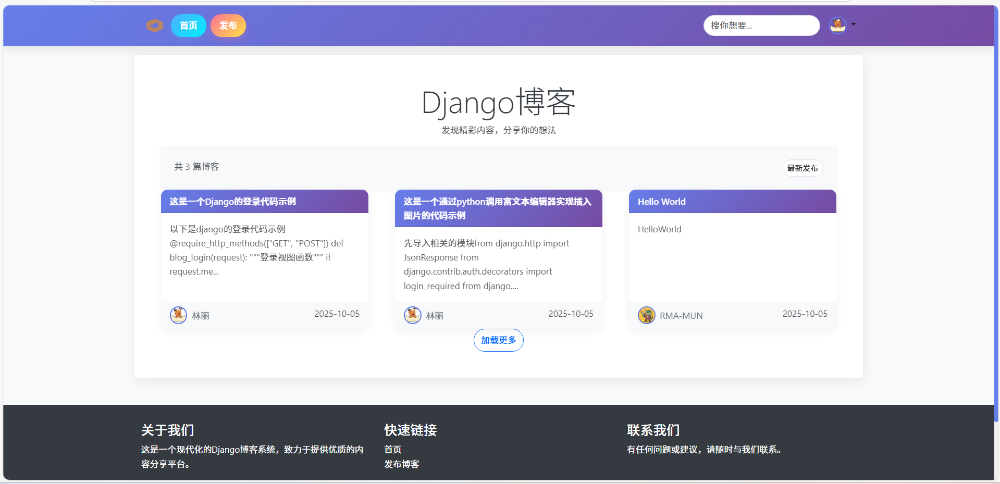
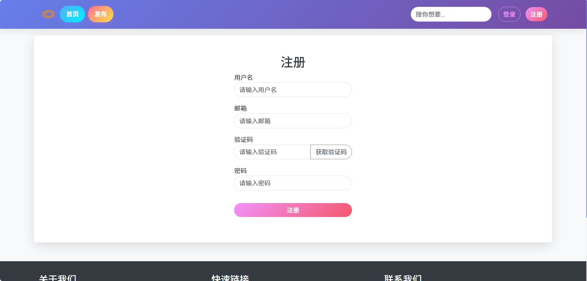
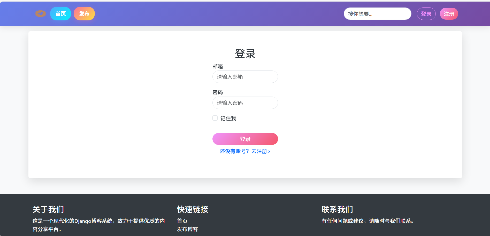
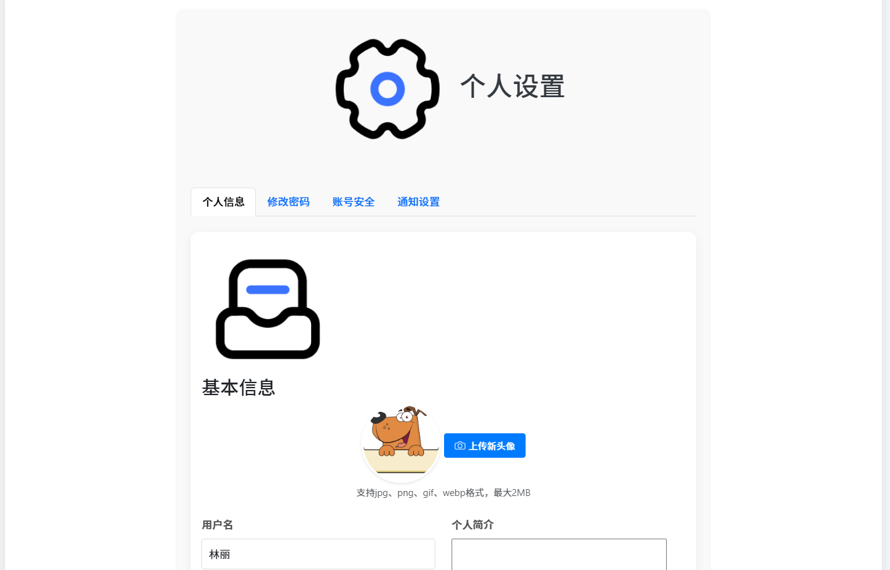
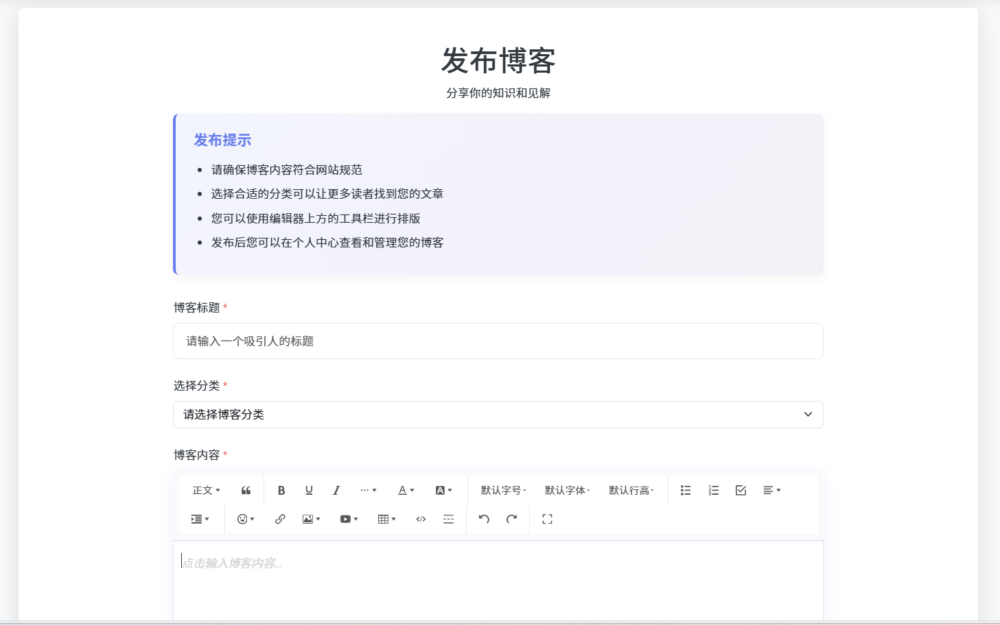
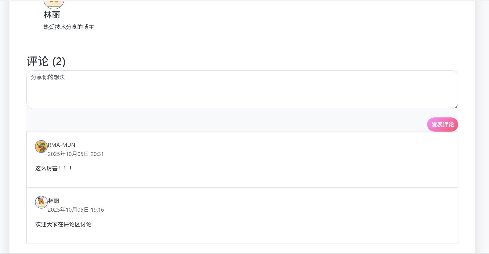

# DjangoBlogProject

基于Django框架开发的博客系统，提供用户管理、博客发布和个人资料管理等功能。

## 项目结构

前端：html,css,javascript
后端：django,mysql

```
DjangoBlogProject/
├── author/         # 用户管理模块
├── blog/           # 博客管理模块
├── media/          # 媒体文件存储（头像等）
├── static/         # 静态资源文件
├── templates/      # HTML模板
└── DjangoBlogProject/ # 项目主配置
```

## 系统截图预览

### 功能界面展示

| 功能模块 | 截图展示 |
|---------|--------|
| 首页 |  |
| 用户注册 |  |
| 用户登录 |  |
| 个人设置 |  |
| 博客发布 |  |
| 评论功能 |  |


## 已实现功能

### 用户管理模块
- 用户注册（支持邮箱验证码验证）
- 用户登录/登出
- 头像上传功能（支持文件类型验证、大小限制、预览和旧头像删除）

### 博客管理模块
- 博客文章发布
- 博客分类管理
- 博客评论功能
- 博客详情页展示
- 搜索功能（支持标题和分类）

### 前端设计
- 响应式布局
- 清晰的选项卡式设置界面
- 头像上传预览功能
- 表单验证和错误提示

### 技术亮点
- 使用Django信号确保用户创建时自动生成个人资料
- 静态资源分离（CSS/JS独立文件）
- 完善的文件上传处理和安全验证
- 模块化的代码结构

## 后续计划功能

- 增加用户关注功能
- 增加用户点赞，浏览量统计功能
- 完善更多的博客管理功能和个人信息的修改

## 项目使用说明

### 系统要求
- Python 3.8+
- Django 5.0+
- MySQL 8.0+

### 安装步骤

1. **克隆项目**
```bash
git clone <项目仓库地址>
cd DjangoBlogProject
```

2. **创建虚拟环境**
```bash
# Windows
python -m venv venv
venv\Scripts\activate

# macOS/Linux
python3 -m venv venv
source venv/bin/activate
```

3. **安装依赖**
```bash
pip install -r requirements.txt
```

4. **配置数据库和信息**
   
   请修改以下文件中的指定行：
   
   1. 文件：`my.cnf`
      - 数据库名称、用户名、密码
   
   2. 文件：`DjangoBlogProject/settings.py`
      - 第22-24行：SECRET_KEY
      - 第146-156行：邮箱配置（EMAIL_HOST_USER、EMAIL_HOST_PASSWORD、DEFAULT_FROM_EMAIL）
   
   完成配置后，创建数据库迁移并应用：
   ```bash
   # 创建数据库迁移
   python manage.py makemigrations

   # 应用数据库迁移
   python manage.py migrate
   ```

5. **创建超级用户**
```bash
python manage.py createsuperuser
```

6. **创建媒体文件目录**
```bash
# Windows
mkdir -p media\avatars\default

# macOS/Linux
mkdir -p media/avatars/default
```

### 运行项目

```bash
python manage.py runserver
```

然后访问 http://127.0.0.1:8000/ 即可查看网站。

### 功能操作说明

1. **用户注册**
   - 访问注册页面，填写邮箱、密码等信息
   - 获取邮箱验证码并完成验证
   - 注册成功后自动登录

2. **个人设置**
   - 登录后访问 /author/settings/ 进入个人设置
   - 可以上传头像、修改个人信息
   - 头像支持JPG、PNG、GIF、WebP格式，大小不超过2MB

3. **发布博客**
   - 登录后可以创建新的博客文章
   - 可以选择分类、添加内容

4. **评论功能**
   - 在博客详情页可以发表评论


## 开发注意事项

1. **媒体文件配置**
   - 确保settings.py中正确配置了MEDIA_URL和MEDIA_ROOT
   - 生产环境中建议使用专业的媒体文件存储服务

2. **安全考虑**
   - 确保在生产环境中修改SECRET_KEY
   - 配置适当的CSRF保护
   - 考虑使用HTTPS

3. **性能优化**
   - 考虑添加缓存机制
   - 优化数据库查询
   - 使用静态文件压缩工具

## License

MIT